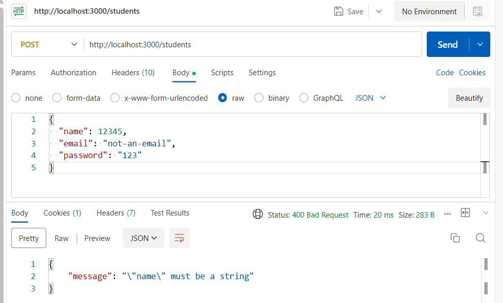
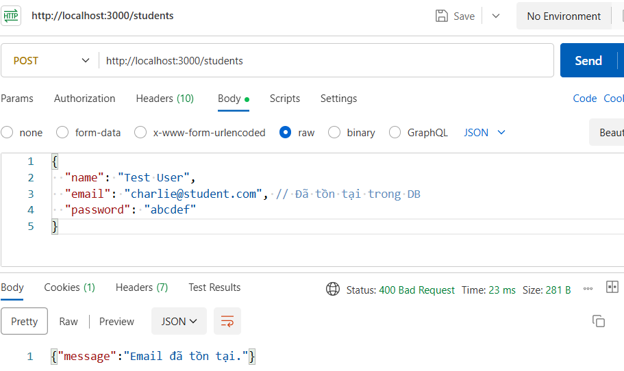
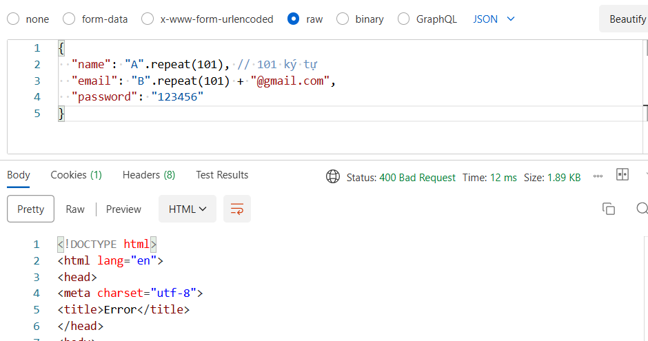
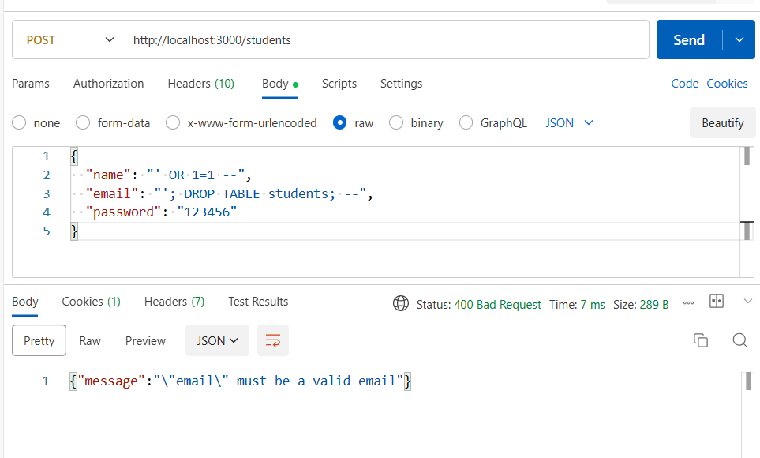
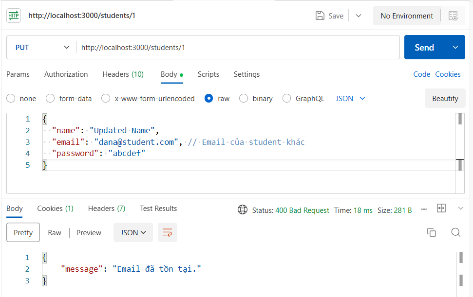
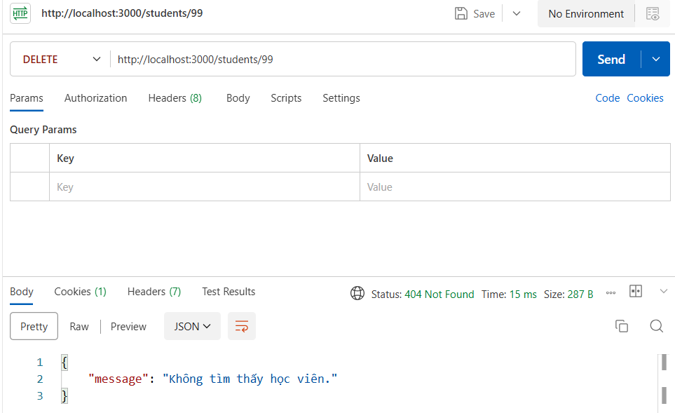

# Security Test Report

## 1. Kiểm tra dữ liệu bất thường

### 1.1. Nhập sai kiểu dữ liệu
- **Request:** POST /students với name là số, email sai định dạng.
- **Kết quả:** API trả về lỗi 400, thông báo lỗi định dạng.
- 

### 1.2. Nhập email trùng
- **Request:** POST /students với email đã tồn tại.
- **Kết quả:** API trả về lỗi 400, thông báo "Email đã tồn tại."
- 

### 1.3. Vượt độ dài
- **Request:** POST /students với name/email > 100 ký tự.
- **Kết quả:** API trả về lỗi 400, thông báo vượt độ dài.
- 

---

## 2. Test SQL Injection

### 2.1. Gửi input độc hại
- **Request:** POST /students với name/email chứa chuỗi SQL injection.
- **Kết quả:** API trả về lỗi 400, không thực thi truy vấn nguy hiểm.
- 

### 2.2. Quan sát log SQL
- **Kết quả:** ORM chỉ chạy prepared statements, không nối chuỗi trực tiếp.
- 

---

## 3. Kiểm tra các thao tác CRUD khác

### 3.1. Update với email trùng
- **Request:** PUT /students/:id với email của student khác.
- **Kết quả:** API trả về lỗi 400, thông báo "Email đã tồn tại."
- 

### 3.2. Delete với id không tồn tại
- **Request:** DELETE /students/9999
- **Kết quả:** API trả về lỗi 404, thông báo "Không tìm thấy học viên."
- 

---

## Tổng kết

- ORM chỉ chạy prepared statements.
- Không có truy vấn thực thi ngoài ý muốn.
- Tất cả input nguy hiểm bị từ chối ở tầng validation.